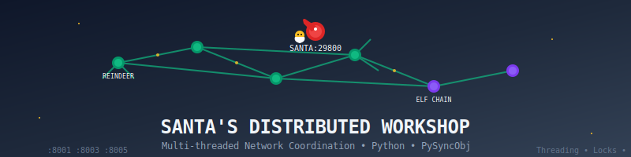
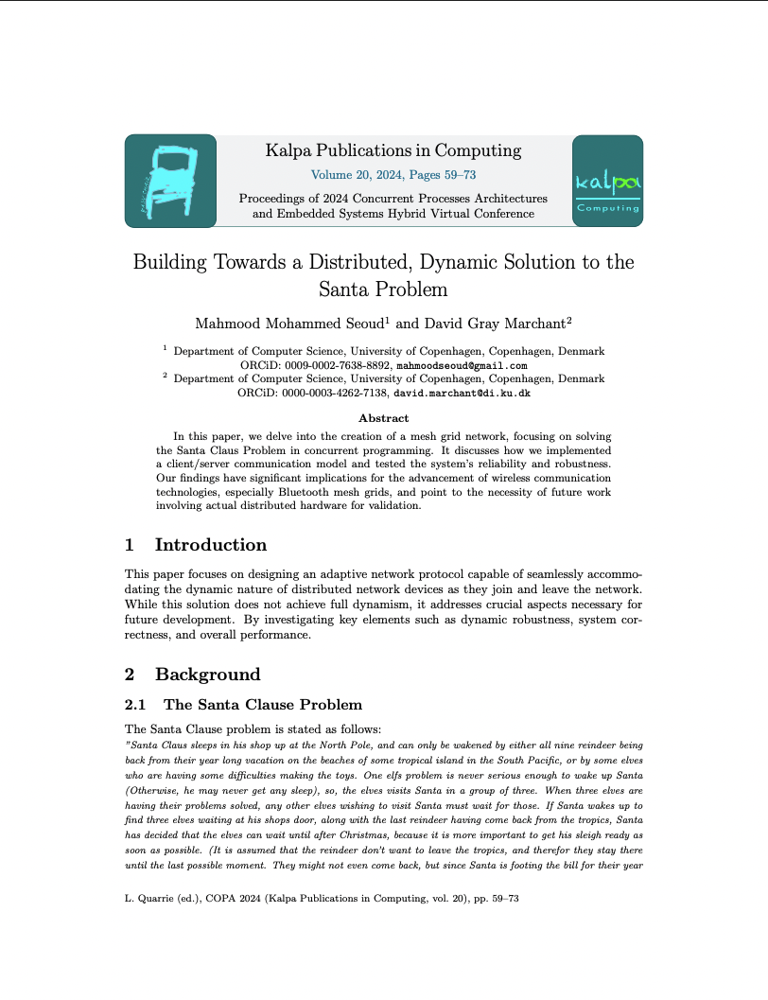

<div align="center"> <p>
    <a align="center" href="" target="_blank">
      
    </a>
  </p>
  <br>

  [documentation](/notes.md) | [paper](https://easychair.org/publications/paper/Gv4N) | [scripts](/threading/scripts)

  <br>

  [](./notes.md)
  [](https://easychair.org/publications/paper/Gv4N)
  [](./LICENSE)
  [](https://www.python.org/)

</div>

# Santa Claus Problem - Distributed Systems Implementation

## Introduction

This repository contains the implementation for my Bachelor Thesis conducted at the University of Copenhagen (DIKU) in 2024. The project explores distributed systems concepts through the classic Santa Claus Problem, presenting both non-distributed and distributed solutions with comprehensive analysis and performance evaluation.

The Santa Claus Problem is a synchronization problem that demonstrates complex coordination between multiple processes, making it an ideal case study for distributed systems implementation.

## Features

### Core Capabilities
- **High-Performance Synchronization**: Efficient process coordination using semaphores and network protocols
- **Dual Implementation**: Both non-distributed (multiprocess) and distributed (network-based) solutions

### Architecture
- **Multiprocess Design**: Shared memory implementation with robust synchronization primitives
- **Network Protocol**: Custom TCP-based protocol for distributed coordination
- **Scalable Design**: Support for variable numbers of reindeer and elves

### Analysis & Monitoring
- **Comprehensive Logging**: Detailed event logging for debugging and performance analysis
- **Performance Metrics**: Built-in timing and throughput measurements
- **Visual Analysis**: Scripts for analyzing and visualizing system behavior

## Installation

To install the necessary dependencies:

```bash
pip install -r requirements.txt
```

> **Note**: Requires Python 3.8 or higher

## Example Usage

### Non-Distributed Implementation

Run the multiprocess implementation with shared memory:

```python
# Run with default configuration (9 reindeer, 10 elves)
python3 ./multiprocess/santa_reindeer_elves.py

# Custom configuration
python3 ./multiprocess/santa_reindeer_elves.py --reindeer 12 --elves 15
```

Santa's log file will be generated in `/threading/log/` for analysis.

### Distributed Implementation

The distributed version requires starting multiple processes:

#### 1. Start Santa Process

```bash
python3 ./threading/santa_thread.py
```

#### 2. Start Reindeer & Elf Processes

For each Reindeer/Elf server, open a separate terminal:

```bash
# Reindeer example
python3 ./threading/reindeer_thread.py log/reindeer_1.log 8000 8002 8004

# Elf example  
python3 ./threading/elf_thread.py log/elf_1.log 9000 9002 9004
```

> **Important**: Each process uses two consecutive ports (e.g., 8000 and 8001), so ensure both are available.

## System Architecture

```
┌─────────────┐     ┌──────────────┐     ┌────────────┐
│    Santa    │────▶│  Coordinator │◀────│  Reindeer  │
└─────────────┘     └──────────────┘     └────────────┘
                            │                     
                            ▼                     
                     ┌────────────┐              
                     │    Elves   │              
                     └────────────┘              
```

## Performance Analysis

The implementation includes comprehensive performance analysis tools:

- **Throughput Analysis**: Measure requests processed per second
- **Latency Tracking**: Monitor response times for different operations
- **Resource Utilization**: Track CPU and memory usage

Run performance analysis:

```bash
python3 ./scripts/analyze_performance.py --log-dir ./threading/log/
```

## Documentation

- [**Architecture Details**](/notes.md): In-depth technical documentation
- [**Implementation Guide**](./docs/implementation.md): Step-by-step implementation details
- [**Performance Report**](./docs/performance.md): Comprehensive performance analysis

## Roadmap

- **Enhanced Fault Tolerance**: Implement recovery mechanisms for process failures
- **Dynamic Scaling**: Support for adding/removing processes at runtime
- **Container Support**: Docker configuration for easy deployment
- **Visualization Tools**: Real-time monitoring dashboard

## Contributing

Contributions are welcome! Please feel free to submit a Pull Request. For major changes, please open an issue first to discuss what you would like to change.

## Contributors

<!-- ALL-CONTRIBUTORS-BADGE:START - Do not remove or modify this section -->
[](#contributors-)
<!-- ALL-CONTRIBUTORS-BADGE:END -->

<!-- ALL-CONTRIBUTORS-LIST:START - Do not remove or modify this section -->
<!-- prettier-ignore-start -->
<!-- markdownlint-disable -->
<table>
  <tbody>
    <tr>
      <td align="center" valign="top" width="14.28%"><a href="https://github.com/MahmoodSeoud"><br /><sub><b>Mahmood Seoud</b></sub></a><br /><a href="#maintenance-mahmood-seoud" title="Maintenance">🚧</a> <a href="#code-mahmood-seoud" title="Code">💻</a> <a href="#doc-mahmood-seoud" title="Documentation">📖</a></td>
    </tr>
  </tbody>
</table>

<!-- markdownlint-restore -->
<!-- prettier-ignore-end -->

<!-- ALL-CONTRIBUTORS-LIST:END -->

## Related Papers

<table>
<td width=30% style='padding: 20px;'>
<a href="https://easychair.org/publications/paper/Gv4N">

</a>
</td>
<td width=70%>
  <p>
    <b>Distributed Implementation of the Santa Claus Problem:</b><br>
    A Study in Process Synchronization and Network Protocols
  </p>
  <p>
    Mahmood Seoud
  </p>
  <p>
    <i>Bachelor Thesis, Department of Computer Science, University of Copenhagen (DIKU), 2024</i>
  </p>
  <div>
    <a href='https://easychair.org/publications/paper/Gv4N'>
      
    </a>
    <a href='https://github.com/mahmood-mahmood/BachelorThesis'>
      
    </a>
    <a href='./notes.md'>
      
    </a>
  </div>
</td>
</table>

## Citation

If you use this implementation in your research, please cite:

```bibtex
@thesis{mahmood2024santa,
  title={Distributed Implementation of the Santa Claus Problem: A Study in Process Synchronization and Network Protocols},
  author={Mahmood, Seoud},
  year={2024},
  school={University of Copenhagen},
  type={Bachelor Thesis}
}
```

## License

This project is licensed under the MIT License - see the [LICENSE](LICENSE) file for details.

## Acknowledgments

- Department of Computer Science, University of Copenhagen (DIKU)
- Thesis Supervisor: David Marchant
- The original Santa Claus Problem by J.A. Trono (1994)
