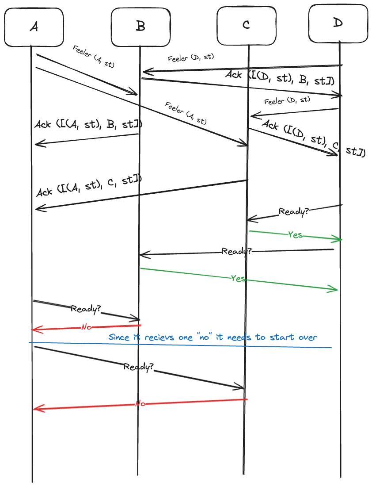

# Bachelor thesis 2024 - DIKU
This repo is for my BachelorThesis on DIKU 2024

## Bachelor Thesis Learning Notes

### Week 1: Introduction and Problem Solving
- Introduction to the goal of creating a Bluetooth mesh grid network with an emphasis on designing an adaptive network protocol.
- The objective is to facilitate coordination of states across the network, accommodating dynamic node joinings and leavings.
- Learned about concepts such as CSP (Communicating Sequential Processes) and multiprocess and multithreading libraries in Python.
- Focused on solving a smaller problem, the Santa Claus Problem, to lay the groundwork for the main project.
- Chose Python for its familiarity and to concentrate on problem-solving rather than language intricacies.
- Utilized the multiprocessing library in Python, including classes such as Queues, Conditions, Lock, and Pipe.
- Program executed locally on a single terminal for initial development and testing.

### Week 2: Implementation and Multi-terminal Setup
- Transitioning from local execution to distributed setup across different terminals. (No more Pipes, Quees)
- Utilizing the Thread library in Python to handle concurrent execution.
- Learning about threads with sub-threads, such as listening and writing threads.
- Communication protocols involving AF_INET format.
- Assigning unique ports to each thread while residing within the same IP address space.
- Experimenting with network configurations to ensure seamless communication between terminals.
- Reading up on deadlock/race conditions

### Week 3: Fixing the implementation from week2
- Reading up on deadlocks (sharing variables between threads)
- Livelock vs deadlock
- Made a "protocol" to differentiate between reindeer communication and Santa communication because the handle action should be different in each case
- Experiencing some deadlocks with the elves
- Reading articles about some potenial algorithms to use for the elves

### Week 4: Redoing the implementation
- I did draw the network diagram so that i copuld redo the entire problem.

- I have gone over to JSON dumps instead of sending bytes indivually since it
    scales better and I am more used to working with JSON

- Right now i am sending signals to other elfs and separting the login in the
    requstHandler. This may change in the future.
- I have tried to do without statemachines, does not work
- Discovered the idea of using a statemachine to denote the current state of these processes. For instance, they could include more info in that feeler acknowledgement, such as what state they are currently in and they could consider themselves a chain root whenever they have enough potential other elves to start forming a chain with. This could be some flag saying what they're trying to do atm. (e.g. are they waiting for more elves, trying to form a chain, building toys etc).


### Week 5: Paxos vs Raft
- I am gonna rework large parts of the logics, and here i discovered two algorithms that could help me. Both of these algos are for getting processes over a distributed system to have consensus. Paxos is older one which is harder to implemenet, thus i am going for Raft! [source](https://raft.github.io) 
- I found a git repo that implements Raft! I am now reading up on this and how to call it. This lib gives you the possibilty of sharing classes on different servers.
- Useful enums to remember for this lib:
    ```py
    class _RAFT_STATE:
        FOLLOWER = 0
        CANDIDATE = 1
        LEADER = 2
    ```

    ```py
    class CONNECTION_STATE:
        DISCONNECTED = 0
        CONNECTING = 1
        CONNECTED = 2
    ```
